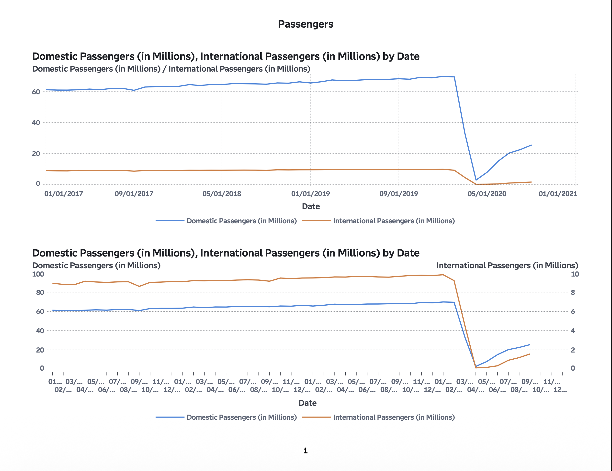
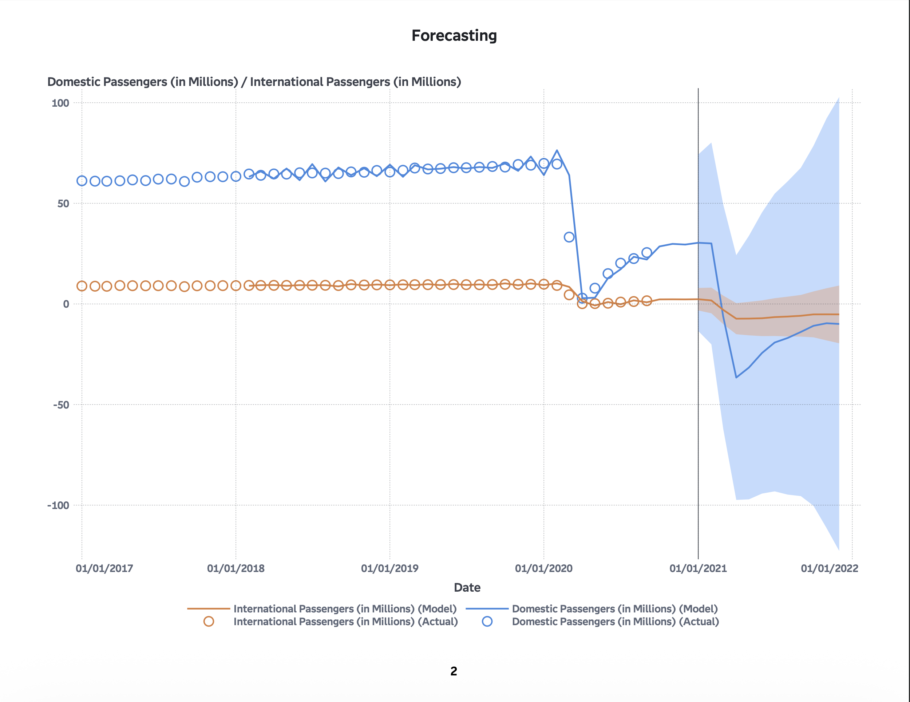
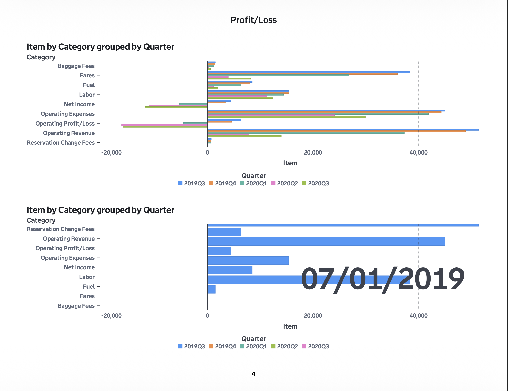

# U.S. Aviation Industry Trends using SAS Visual Analytics

## Overview

Interactive SAS Visual Analytics dashboard analyzing the impact of COVID-19 on the U.S. airline industry using U.S. Department of Transportation data.

## Tools Used

* SAS Visual Analytics
* SAS Viya for Learners

## Features

* Passenger traffic trend analysis
* Forecasting models
* Airline employment analysis
* Profit and loss visualization
* Revenue and expense analysis
* Interactive filtering and controls

## Passenger Traffic Dashboard

## Forecasting Analysis

## Profit and Loss Dashboard

## Key Insights

* Passenger traffic sharply declined during COVID-19
* International passenger traffic recovered slower than domestic travel
* Airlines experienced significant financial losses beginning in 2020
* Forecasting models showed high uncertainty following the pandemic disruption

## Full Report

[View Full Report](Reports/US_Aviation_Industry_Trends_Report.pdf)
